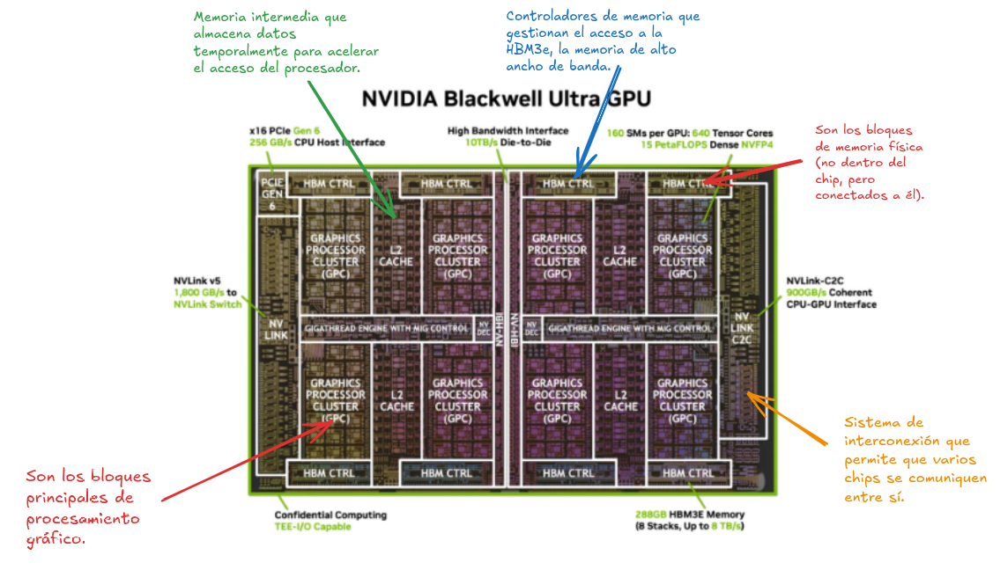
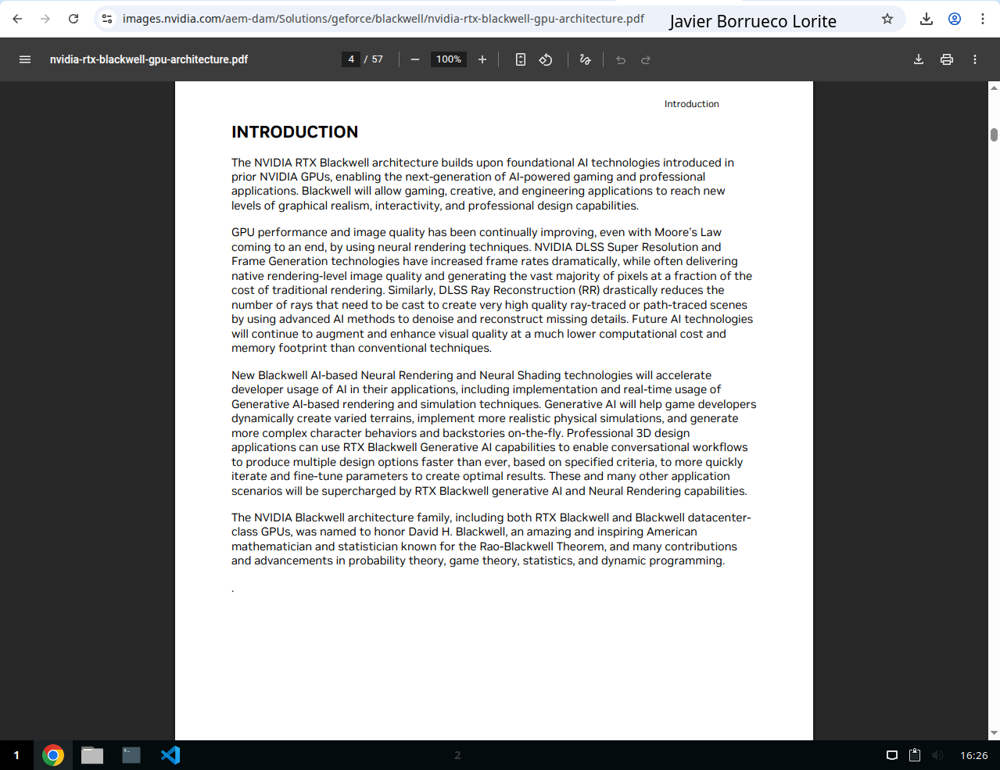
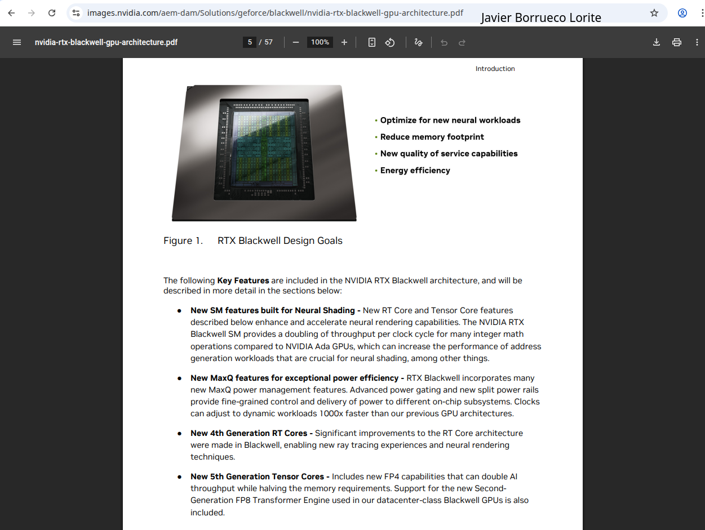
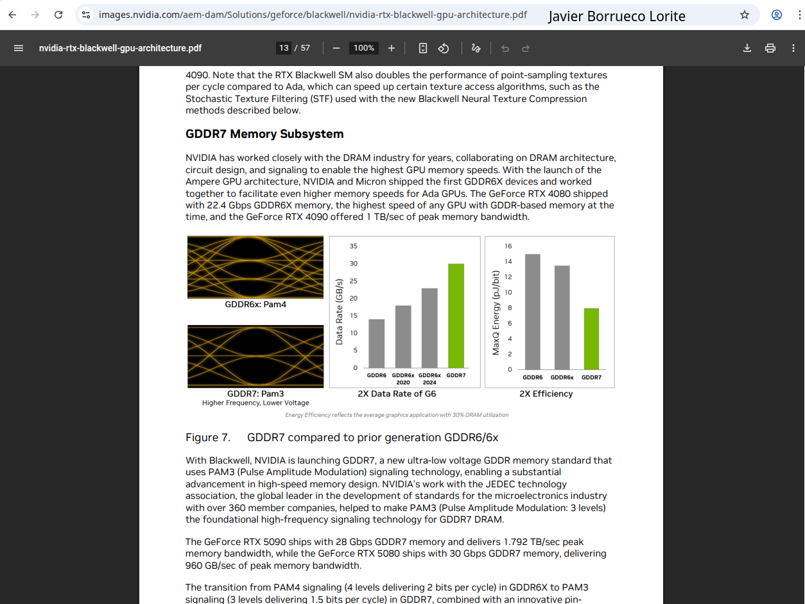

# Arquitectura moderna

**Alumno/a:** Javier Borrueco Lorite
**Grupo:** ASIR
**Arquitectura elegida:** NVIDIA Blackwell
------------------------------------------

## A) Básico — Qué es y para qué sirve

- La NVIDIA RTX Blackwell es yuna arquitectura de tarjetas gráficas pensada para usar IA dentro de los juegos y programas 3D. Se usa en ordenadores de gaming, diseño, creación de contenido y centros de datos para acelerar tareas con IA. Su idea principal mezcla gráficos tradicionales y redes neuronales para mejorar la calidad sin gatsar tanta potencia. Además, usa memorias más rápidas y núcleos especiales.

### Representación visual

**O1. Lista de bloques Ejemplo**

### CAPTURA 1 — Búsqueda avanzada (con tu nombre y grupo)

--------------------------------

## B) Intermedio — Problema que mejora + comparativa

**Problema que mejora**

Ésta mejora el problema de rendimiento y eficiencia, ahora puede hacer más calculos de inteligencia artificial y ray tracing en menos tiempo y con menos energía. Además, reduce los cuellos de botella de memoria e interconexión, haciendo que los juegos y modelos de IA funcionen más fluidos y realistas.

**Tabla comparativa (≥3 filas)**

| Aspecto                           | PC clásico monolítico                                  | Arquitectura elegida                                                                                  |
| ----------------------------------- | ---------------------------------------------------------- | ------------------------------------------------------------------------------------------------------- |
| ISA(Instruction Set Architecture) | ISA general                                              | ISA ampliada con Neural Shaders y nuevas instrucciones para IA y renderizado neuronal                 |
| Memoria                           | Ram DDR4/DDR5 (50/100 GB/s de AB)                        | GDDR7(PAM3) con hasta 1792 TB/s, mucho mas rapida y eficiente                                         |
| Interconexión                    | Bus interno limitado (entre CPU, RAM y GPU)              | PCle Gen5 + NVLink para interconexión ultrarápida CPU↔GPU↔RAM                                     |
| Aceleradores                      | Núcleos Generales                                       | RT Cores 4ªgen + Tensor Cores 5ª gen(FP4)→ cálculo masivo de IA y ray tracing en tiempo real      |
| Objetivo principal                | Ejecución general de programas y cálculos secuenciales | Renderizado + IA en tiempo real, más rendimiento con menos energía (DLSS 4, Multi-Frame Generation) |

### CAPTURA 2 — Fuente oficial/técnica

----------------------------------------------

## C) Curioso — Dato/cifra + evidencia

**Dato/cifra (1 frase):**

GDDR7 @ 2 Gbps → 1.792 TB/s de ancho de banda pico. 

### CAPTURA 3 — Dato/diagrama señalado

--------------------------------------

[Fuentes](https://images.nvidia.com/aem-dam/Solutions/geforce/blackwell/nvidia-rtx-blackwell-gpu-architecture.pdf)
